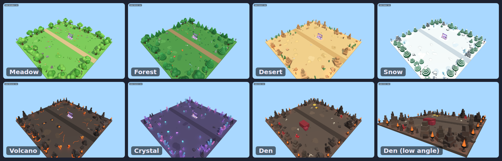
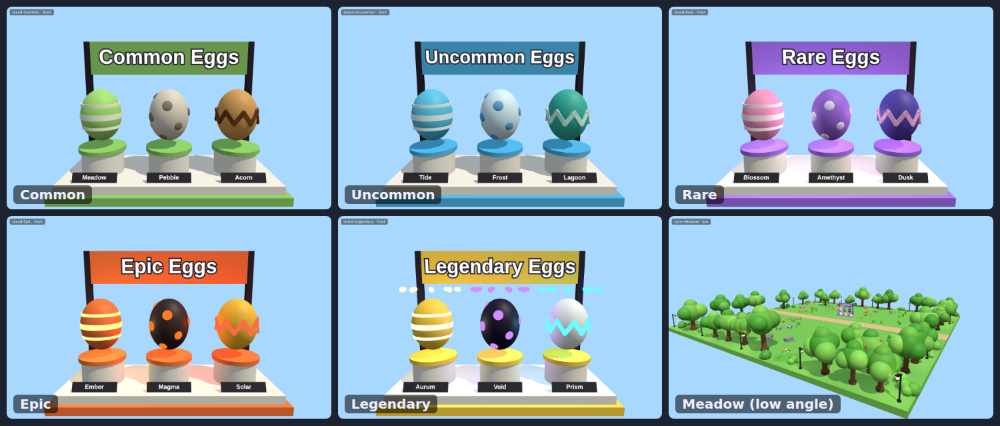

# 3dmodeling

Roblox builders for a pet-simulator style game:

- **Eggs:** every tier has exactly **3 variations** (Stripes, Spots, Zigzag), with display stands and templates you can clone.
- **Zone decorations:** themed props that frame each zone, fill it in, and leave the play area open.

Everything is built from primitive parts, built-in materials and built-in particle textures. Nothing uses uploaded images or meshes, so nothing waits on moderation or fails to load (no white SurfaceAppearance textures).




## What's in it

| Path | Where Rojo puts it | What it does |
| --- | --- | --- |
| `src/shared/EggConfig.luau` | `ReplicatedStorage.Shared.EggConfig` | Egg tiers and their 3 variations. Validated on load, so a tier with 2 or 4 variations errors immediately. |
| `src/builders/EggBuilder.luau` | `ServerStorage.Builders` | Builds eggs, per-tier display stands and clone templates. |
| `src/builders/ZoneDecorator.luau` | `ServerStorage.Builders` | Decorates a zone with a theme. |
| `src/builders/ZoneThemes.luau` | `ServerStorage.Builders` | 7 themes: Meadow, Forest, Desert, Snow, Volcano, Crystal, Den (the sleeping-boss lair). |
| `src/builders/Props.luau` | `ServerStorage.Builders` | 24 procedural props: trees, pines, rock spires, basalt columns, crystals, braziers, lanterns, treasure hoards and more. |
| `src/client/AmbientAnimator.client.luau` | `StarterPlayer.StarterPlayerScripts` | Client-side motion: eggs bob and spin, halos turn, fire lights flicker. |

## Getting it into Studio

Sync with [Rojo](https://rojo.space) (`rojo serve`, then connect from the Studio plugin), or copy each file into the location in the table above as a ModuleScript. The animator is a LocalScript.

## Decorating zones

Give each zone Model (or Folder) a `ZoneTheme` string attribute (`Meadow`, `Forest`, `Desert`, `Snow`, `Volcano`, `Crystal` or `Den`). Then run this in the command bar:

```lua
local ZoneDecorator = require(game.ServerStorage.Builders.ZoneDecorator)
for _, report in ZoneDecorator.decorateAll(workspace.Zones) do
	print(ZoneDecorator.describe(report))
end
```

To decorate a single zone:

```lua
ZoneDecorator.decorate(workspace.Zones.Lava, { theme = "Volcano", density = 1.2, seed = 7 })
```

- The output goes into one `Decorations` folder inside the zone. Running it again replaces that folder, and the same seed gives the same layout.
- **Floor:** the widest flat part in the zone, plus tiles with the same color, material and height. If that picks the wrong thing, tag the floor parts `ZoneGround`.
- **Left alone:** anything already standing on the floor (egg stands, paths, walls, the boss, spawns), with `padding` studs of room around it (default 2). Invisible, non-colliding trigger volumes are ignored.
- **Reserving space:** to keep an area empty (an arena, a walkway), put an invisible part there and tag it `KeepClear`, or pass `keepClear = { { position = Vector3, radius = number } }`.
- Big props line the edge. The middle stays open for players.
- **Options:** `density` (default 1), `seed` (default: the zone's name), `padding`, `perimeter = false` (no lamps or torches on the edge), `ambient = false` (no floating particles).
- **Terrain floors:** pass `ground = { workspace.Terrain }` and `bounds = { center = Vector3, size = Vector3 }`.
- **Part cost:** about 600 to 1,250 parts per 140×140 zone at density 1. Lower `density` if you need fewer.

## Eggs

```lua
local EggBuilder = require(game.ServerStorage.Builders.EggBuilder)

-- A stand with the tier's 3 eggs, facing the point it looks at:
EggBuilder.buildStand("Rare", CFrame.lookAt(Vector3.new(0, 0, 40), Vector3.new(0, 0, 0)), workspace)

-- Templates for game code to clone: EggTemplates/<Tier>/<Egg name>
EggBuilder.buildTemplates(game.ReplicatedStorage)
```

- To choose which of the 3 variations an egg is: `EggConfig.pickVariation("Rare", Random.new():NextNumber())`. Each variation has equal odds.
- To change colors, names or patterns, edit `EggConfig.Tiers`. Adding a tier works the same way, but it must have exactly 3 variations. Validation enforces this.
- Egg models carry `Tier` and `Variation` attributes and an `Egg` tag.

## Development

The builders run outside Studio under [Lune](https://lune-org.github.io/docs), which emulates Roblox instances. `tools/lune/World.luau` stands in for raycasts and overlap queries.

```sh
lune run tests/run                  # test suite
rojo sourcemap default.project.json -o sourcemap.json
luau-lsp analyze --platform=roblox --definitions=@roblox=globalTypes.d.luau --sourcemap=sourcemap.json src
stylua src tools tests              # formatting

# Preview renders (three.js in headless Chromium), written to tools/preview/out/*.png
lune run tools/preview/build
cd tools/preview && npm install && node render.mjs
```

The previews approximate Roblox's lighting and materials. They're good for judging layout and color, but Studio has the final say.
